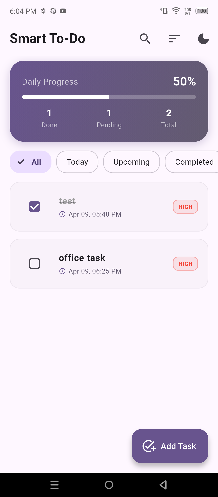
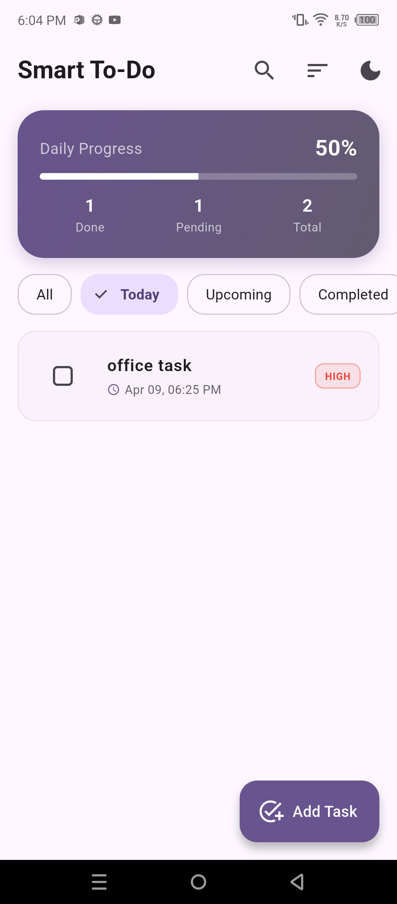
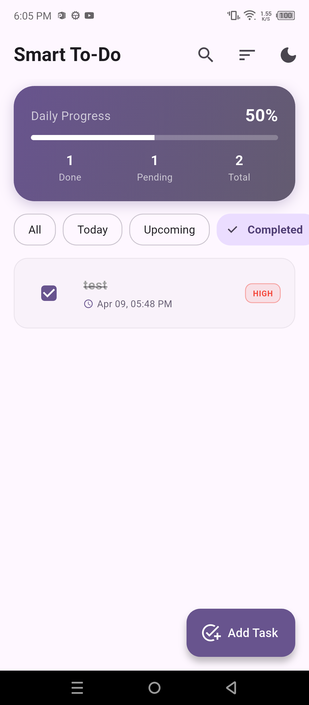
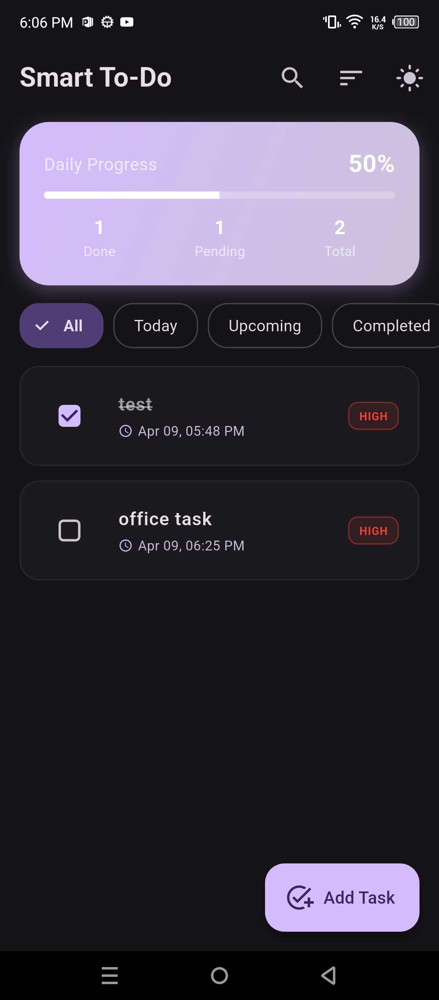
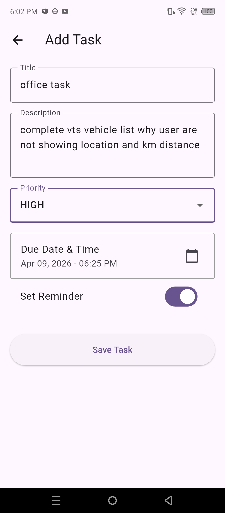
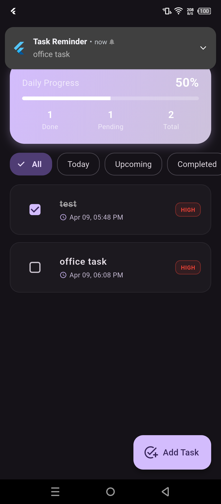

# 🚀 Smart To-Do App

**Smart To-Do** is a high-performance, feature-rich productivity application built with Flutter. Unlike basic to-do lists, this app focuses on "Smart" management through real-time analytics, automated reminders, and advanced sorting/searching capabilities to help users stay on top of their goals.

---

## 📸 1. How It Looks
Explore the user interface of the app:

| Home Dashboard | Today's Tasks | Completed Tasks |
|:---:|:---:|:---:|
|  |  |  |

| Dark Mode | Add Task | Reminder Setup |
|:---:|:---:|:---:|
|  |  |  |

---

## 🏛️ 2. Architecture: The Provider Pattern
This project follows the **Provider (MVVM-inspired) Architecture**. 
We separate the app into three distinct layers:
1.  **Data Layer**: SQLite (`sqflite`) for tasks and `SharedPreferences` for settings.
2.  **Logic Layer (Provider)**: The "Brain" that handles business logic and state.
3.  **UI Layer (Screens)**: Pure widgets that listen to the logic layer and display data.

### Architecture Flow:
`User Action (UI)` ➔ `Provider Method` ➔ `Database/Service Update` ➔ `notifyListeners()` ➔ `UI Rebuilds`

---

## 🎓 3. What We Learned
By building this project, we mastered several core mobile development concepts:
*   **Persistent Storage**: Managing structured data with relational databases (SQLite).
*   **State Management**: Using `Provider` to keep UI in sync across different screens.
*   **Native OS Integration**: Using `flutter_local_notifications` to schedule system-level alerts.
*   **User Experience (UX)**: Implementing Search, Sort, and Filter algorithms.
*   **Theme Management**: Handling Dark/Light mode persistence.
*   **Advanced UI**: Working with gradients, custom progress indicators, and responsive layouts.

---

## 🔑 4. Keywords & Definitions
Here is a breakdown of the technical "building blocks" used in this project:

| Keyword | Description | Use Case in this App |
|---|---|---|
| **Provider** | A state management library for Flutter. | To share task data between the Home and Detail screens. |
| **ChangeNotifier** | A class that provides change notifications to listeners. | Our `TaskProvider` extends this to tell the UI when a task is added/deleted. |
| **SQLite (sqflite)** | A local relational database. | To permanently store tasks so they don't disappear when the app closes. |
| **SharedPreferences** | Simple key-value storage. | To remember if the user prefers Dark Mode or Light Mode. |
| **Async/Await** | Tools for handling operations that take time (like DB calls). | Used when saving tasks to the database or fetching them. |
| **Local Notifications** | OS-level alerts. | To remind the user about a task even if the app is closed. |
| **intl** | A package for internationalization and formatting. | To turn messy date objects into readable text like "Apr 09, 05:48 PM". |
| **Sliver** | Specialized scrollable areas. | Used for the collapsing AppBars and smooth scrolling effects. |

---

## 📂 5. File-by-File Learning Log
To build this app, we touched multiple layers of the project, from high-level UI to deep Android system configurations. Here is why:

### 📦 Configuration & Dependencies
1.  **`pubspec.yaml`**
    *   *Reason*: The project's manifest. We added essential libraries here: `sqflite` (Database), `provider` (State), `flutter_local_notifications` (Reminders), and `shared_preferences` (Settings).
2.  **`android/app/build.gradle.kts`**
    *   *Reason*: Modernizing the Android build. We enabled **Core Library Desugaring** to support modern Java features on older devices and updated `minSdk` for compatibility with notification plugins.
3.  **`android/app/src/main/AndroidManifest.xml`**
    *   *Reason*: Permissions & Security. We added permissions for Alarms, Notifications, and Boot completion. We also fixed Android 12+ security requirements by explicitly setting `android:exported`.
4.  **`android/gradle.properties`**
    *   *Reason*: Build Stability. We disabled **Kotlin Incremental Compilation** to fix a "different roots" error common when project files reside on a different drive than the SDK on Windows.

### 🧠 Logic & Data
5.  **`lib/models/task.dart`**
    *   *Reason*: Data Modeling. Created a blueprint for what a "Task" is, including methods to convert tasks to/from Maps for database storage.
6.  **`lib/database/db_helper.dart`**
    *   *Reason*: Local Storage. Implemented the SQLite helper to manage database creation and CRUD (Create, Read, Update, Delete) operations.
7.  **`lib/services/notification_service.dart`**
    *   *Reason*: System Integration. Configured the local notifications plugin to handle task reminders and time-zone-aware scheduling.
8.  **`lib/providers/task_provider.dart`**
    *   *Reason*: State Management. This is the "Brain" where we handle search logic, sorting by priority/date, analytics calculations, and theme toggling.

### 🎨 User Interface (UI)
9.  **`lib/screens/home_screen.dart`**
    *   *Reason*: The Dashboard. Built the main interface featuring a gradient progress card, searchable task list, and swipe-to-delete functionality.
10. **`lib/screens/task_detail_screen.dart`**
    *   *Reason*: Input & Forms. Implemented the task creation form with data validation, priority selection, and Date/Time pickers.
11. **`lib/main.dart`**
    *   *Reason*: The Foundation. The entry point where we initialize services and provide the `TaskProvider` to the widget tree.

### 🧪 Testing
12. **`test/widget_test.dart`**
    *   *Reason*: Reliability. Updated the default smoke test to recognize our custom `SmartToDoApp` class, ensuring the build pipeline stays green.

---

## 🛠️ How to Run
1.  Enable **Developer Mode** on your Windows system.
2.  Run `flutter pub get`.
3.  Connect your device and run `flutter run`.
